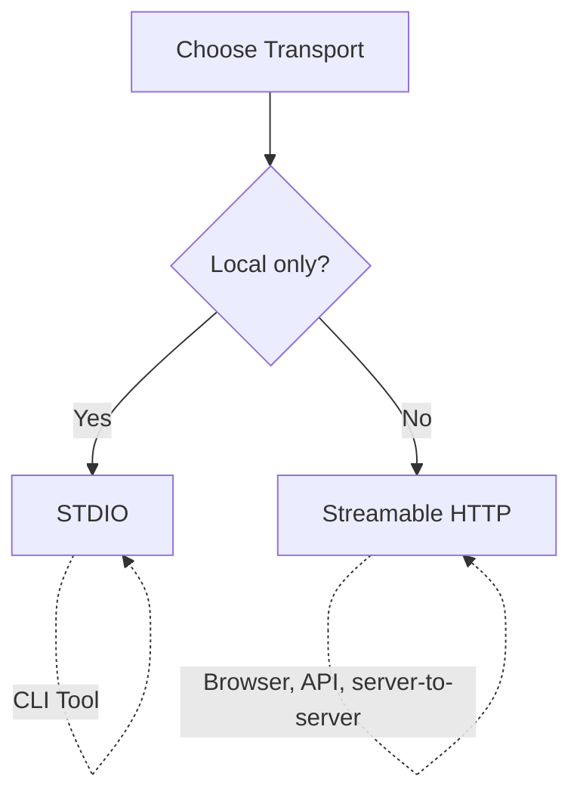

# MCP Transport Options

The Odoo MCP Server supports three transport mechanisms for different use cases:

| Transport | Status | Use Case | Port | Clients |
|-----------|--------|----------|------|---------|
| **STDIO** | Active | Claude Desktop, CLI tools | N/A | Process pipes |
| **Streamable HTTP** | Active | API integrations, web, programmatic | 8008 | httpx, fetch API |
| **SSE** | ⚠️ **Deprecated** | Legacy clients only | 8009 | EventSource, curl |

> **SSE is deprecated upstream.** The MCP specification deprecated the HTTP+SSE
> transport in protocol revision `2025-03-26` and reclassified it as formally
> **Deprecated** under the feature lifecycle policy in `2026-07-28`, which
> guarantees a minimum twelve-month window before removal becomes possible.
>
> It still works here and we have no plan to drop it before upstream does — but
> **do not build anything new on it.** Use Streamable HTTP, which covers every
> SSE use case including browsers. If you are on SSE today, the migration is
> mostly a port and path change (`:8009/sse` → `:8008/mcp`); see
> [Migration: SSE → Streamable HTTP](#migration-sse--streamable-http) below.

## STDIO Transport (Default)

**Best for:** Claude Desktop, command-line tools, local integrations

**Characteristics:**
- Process-to-process communication via stdin/stdout
- No network exposure
- Lowest latency
- Default transport for Claude Desktop

### Setup

```bash
# Install package
pip install -e .

# Console script
odoo-mcp

# Or as a module (equivalent)
python -m odoo_mcp
```

### Claude Desktop Configuration

```json
{
  "mcpServers": {
    "odoo": {
      "command": "python",
      "args": ["-m", "odoo_mcp"],
      "env": {
        "ODOO_URL": "https://your-instance.odoo.com",
        "ODOO_DB": "your-database",
        "ODOO_USERNAME": "your-username",
        "ODOO_PASSWORD": "your-password"
      }
    }
  }
}
```

## SSE Transport (Server-Sent Events) — ⚠️ Deprecated

> **Deprecated upstream — do not adopt for new work.** Deprecated in MCP
> protocol revision `2025-03-26`, formally Deprecated under the feature
> lifecycle policy in `2026-07-28`. Use
> [Streamable HTTP](#streamable-http-transport) instead; it serves browsers too.
> This section is retained for users maintaining existing SSE deployments.

**Best for:** existing SSE deployments only

**Characteristics:**
- One-way server-to-client streaming over HTTP
- Works with EventSource API in browsers
- Simple HTTP GET requests
- No WebSocket required

### Setup

```bash
# Install package
pip install -e .

# Run SSE server
odoo-mcp-sse

# With custom configuration
MCP_HOST=localhost MCP_PORT=9000 MCP_SSE_PATH=/events odoo-mcp-sse
```

### Environment Variables

| Variable | Default | Description |
|----------|---------|-------------|
| `MCP_HOST` | 127.0.0.1 | Host to bind to. This runner has **no authentication** — only set `0.0.0.0` behind an auth layer. |
| `MCP_PORT` | 8009 | Port to listen on |
| `MCP_SSE_PATH` | /sse | SSE endpoint path |

### Docker

**Development (Less Secure, More Convenient):**
```bash
# Build
docker build -t alanogic/mcp-odoo-adv:sse -f Dockerfile.sse .

# Run with full writable mount
docker run -p 8009:8009 \
  -v $(pwd):/app \
  --env-file .env \
  alanogic/mcp-odoo-adv:sse
```

**Production (Secure, Recommended):**
```bash
# Build
docker build -t alanogic/mcp-odoo-adv:sse -f Dockerfile.sse .

# Run with security hardening
docker run -p 8009:8009 \
  -v $(pwd):/app:ro \
  -v $(pwd)/COOKBOOK.md:/app/COOKBOOK.md:rw \
  -v $(pwd)/logs/sse:/app/logs \
  --env-file .env \
  --security-opt=no-new-privileges:true \
  --cap-drop=ALL \
  --read-only \
  --tmpfs /tmp \
  --tmpfs /app/logs \
  alanogic/mcp-odoo-adv:sse

# Or with docker-compose (recommended)
docker-compose up odoo-mcp-sse
```

### Client Examples

**JavaScript (Browser)**
```javascript
const eventSource = new EventSource('http://localhost:8009/sse');

eventSource.onmessage = (event) => {
  const data = JSON.parse(event.data);
  console.log('Received:', data);
};

eventSource.onerror = (error) => {
  console.error('SSE Error:', error);
};
```

**Python**
```python
import requests

with requests.get('http://localhost:8009/sse', stream=True) as response:
    for line in response.iter_lines():
        if line:
            print(line.decode('utf-8'))
```

**curl**
```bash
curl -N http://localhost:8009/sse
```

## Streamable HTTP Transport

**Best for:** API integrations, programmatic access, bidirectional streaming

**Characteristics:**
- Full bidirectional streaming over HTTP
- Works with standard HTTP clients
- POST requests with streaming bodies
- Suitable for server-to-server communication

### Setup

```bash
# Install package
pip install -e .

# Run HTTP server
odoo-mcp-http

# With custom configuration
MCP_HOST=localhost MCP_PORT=9000 MCP_HTTP_PATH=/api odoo-mcp-http
```

### Environment Variables

| Variable | Default | Description |
|----------|---------|-------------|
| `MCP_HOST` | 127.0.0.1 | Host to bind to. This runner has **no authentication** — only set `0.0.0.0` behind an auth layer, or use `odoo-mcp-http-secure` (Bearer token, defaults to `0.0.0.0`). |
| `MCP_PORT` | 8008 | Port to listen on |
| `MCP_HTTP_PATH` | /mcp | HTTP endpoint path |

### Docker

**Development (Less Secure, More Convenient):**
```bash
# Build
docker build -t alanogic/mcp-odoo-adv:http -f Dockerfile.http .

# Run with full writable mount
docker run -p 8008:8008 \
  -v $(pwd):/app \
  --env-file .env \
  alanogic/mcp-odoo-adv:http
```

**Production (Secure, Recommended):**
```bash
# Build
docker build -t alanogic/mcp-odoo-adv:http -f Dockerfile.http .

# Run with security hardening
docker run -p 8008:8008 \
  -v $(pwd):/app:ro \
  -v $(pwd)/COOKBOOK.md:/app/COOKBOOK.md:rw \
  -v $(pwd)/logs/http:/app/logs \
  --env-file .env \
  --security-opt=no-new-privileges:true \
  --cap-drop=ALL \
  --read-only \
  --tmpfs /tmp \
  --tmpfs /app/logs \
  alanogic/mcp-odoo-adv:http

# Or with docker-compose (recommended)
docker-compose up odoo-mcp-http
```

### Client Examples

**Python (httpx)**
```python
import httpx
import json

async with httpx.AsyncClient() as client:
    request_data = {
        "jsonrpc": "2.0",
        "method": "tools/list",
        "params": {},
        "id": 1
    }

    async with client.stream(
        'POST',
        'http://localhost:8008/mcp',
        json=request_data,
        headers={'Content-Type': 'application/json'}
    ) as response:
        async for line in response.aiter_lines():
            if line:
                print(json.loads(line))
```

**JavaScript (fetch)**
```javascript
const response = await fetch('http://localhost:8008/mcp', {
  method: 'POST',
  headers: {'Content-Type': 'application/json'},
  body: JSON.stringify({
    jsonrpc: '2.0',
    method: 'tools/list',
    params: {},
    id: 1
  })
});

const reader = response.body.getReader();
while (true) {
  const {done, value} = await reader.read();
  if (done) break;
  console.log(new TextDecoder().decode(value));
}
```

**curl**
```bash
curl -X POST http://localhost:8008/mcp \
  -H "Content-Type: application/json" \
  -d '{"jsonrpc":"2.0","method":"tools/list","params":{},"id":1}'
```

## Migration: SSE → Streamable HTTP

SSE is deprecated upstream (see the note at the top of this document). Streamable
HTTP replaces it for every use case, browsers included. The server exposes the
same tools, resources and prompts on both — only the endpoint changes.

**1. Change how you start the server**

```bash
# Before
odoo-mcp-sse                     # 127.0.0.1:8009/sse

# After
odoo-mcp-http                    # 127.0.0.1:8008/mcp
odoo-mcp-http-secure             # adds Bearer auth; requires MCP_BEARER_TOKEN
```

**2. Change the environment variables**

| SSE | Streamable HTTP |
|---|---|
| `MCP_SSE_PATH` (default `/sse`) | `MCP_HTTP_PATH` (default `/mcp`) |
| `MCP_PORT` (default 8009) | `MCP_PORT` (default 8008) |
| `MCP_HOST` | `MCP_HOST` (unchanged) |

**3. Change the client URL**

```diff
- http://localhost:8009/sse
+ http://localhost:8008/mcp
```

**4. Swap the Docker image**

```bash
# Before
docker build -t mcp/odoo:sse -f Dockerfile.sse .

# After
docker build -t mcp/odoo:http -f Dockerfile.http .
```

In `docker-compose.yml`, drop the `odoo-mcp-sse` service and keep
`odoo-mcp-http`. If you terminate TLS at nginx, update the `proxy_pass` target
and remove any SSE-specific buffering directives — see `nginx.conf.example`.

**5. Verify**

```bash
curl -X POST http://localhost:8008/mcp \
  -H "Content-Type: application/json" \
  -d '{"jsonrpc":"2.0","method":"tools/list","params":{},"id":1}'
```

You should get all three tools back: `execute_method`, `batch_execute`,
`add_cookbook_pattern`.

## Production Deployment

### Nginx Reverse Proxy

For production deployments, use Nginx as a reverse proxy to add SSL, authentication, and rate limiting.

```nginx
# /etc/nginx/sites-available/mcp-odoo

upstream mcp_sse {
    server 127.0.0.1:8009;
}

upstream mcp_http {
    server 127.0.0.1:8008;
}

server {
    listen 443 ssl http2;
    server_name mcp.yourdomain.com;

    ssl_certificate /etc/letsencrypt/live/mcp.yourdomain.com/fullchain.pem;
    ssl_certificate_key /etc/letsencrypt/live/mcp.yourdomain.com/privkey.pem;

    # SSE endpoint
    location /sse {
        proxy_pass http://mcp_sse;
        proxy_http_version 1.1;
        proxy_set_header Upgrade $http_upgrade;
        proxy_set_header Connection '';
        proxy_set_header Host $host;
        proxy_cache_bypass $http_upgrade;

        # SSE-specific settings
        proxy_buffering off;
        proxy_read_timeout 24h;
        chunked_transfer_encoding off;
    }

    # Streamable HTTP endpoint
    location /mcp {
        proxy_pass http://mcp_http;
        proxy_http_version 1.1;
        proxy_set_header Host $host;
        proxy_set_header X-Real-IP $remote_addr;
        proxy_set_header X-Forwarded-For $proxy_add_x_forwarded_for;
        proxy_set_header X-Forwarded-Proto $scheme;

        # Streaming settings
        proxy_buffering off;
        proxy_request_buffering off;
        client_max_body_size 100M;
    }
}
```

### Security Configurations

#### Option 1: API Key Authentication

Secure endpoints with custom API key headers.

```nginx
# /etc/nginx/sites-available/mcp-odoo-secure

# Define API key (store in separate file for production)
map $http_x_api_key $api_key_valid {
    default 0;
    "your-secret-api-key-here" 1;
}

upstream mcp_http {
    server 127.0.0.1:8008;
}

server {
    listen 443 ssl http2;
    server_name mcp.yourdomain.com;

    ssl_certificate /etc/letsencrypt/live/mcp.yourdomain.com/fullchain.pem;
    ssl_certificate_key /etc/letsencrypt/live/mcp.yourdomain.com/privkey.pem;

    # Streamable HTTP endpoint with API key auth
    location /mcp {
        # Validate API key
        if ($api_key_valid = 0) {
            return 401 '{"error": "Unauthorized - Invalid or missing API key"}';
        }

        proxy_pass http://mcp_http;
        proxy_http_version 1.1;
        proxy_set_header Host $host;
        proxy_set_header X-Real-IP $remote_addr;
        proxy_set_header X-Forwarded-For $proxy_add_x_forwarded_for;

        # Streaming settings
        proxy_buffering off;
        proxy_request_buffering off;
        client_max_body_size 100M;
    }
}
```

**Client Usage:**
```bash
# curl with API key
curl -X POST https://mcp.yourdomain.com/mcp \
  -H "X-API-Key: your-secret-api-key-here" \
  -H "Content-Type: application/json" \
  -d '{"jsonrpc":"2.0","method":"tools/list","params":{},"id":1}'
```

```python
# Python with API key
import httpx

headers = {
    "X-API-Key": "your-secret-api-key-here",
    "Content-Type": "application/json"
}

async with httpx.AsyncClient() as client:
    response = await client.post(
        "https://mcp.yourdomain.com/mcp",
        headers=headers,
        json={"jsonrpc": "2.0", "method": "tools/list", "params": {}, "id": 1}
    )
```

#### Option 2: Basic Authentication

Simple username/password authentication.

```nginx
# /etc/nginx/sites-available/mcp-odoo-basic-auth

upstream mcp_http {
    server 127.0.0.1:8008;
}

server {
    listen 443 ssl http2;
    server_name mcp.yourdomain.com;

    ssl_certificate /etc/letsencrypt/live/mcp.yourdomain.com/fullchain.pem;
    ssl_certificate_key /etc/letsencrypt/live/mcp.yourdomain.com/privkey.pem;

    location /mcp {
        # Basic authentication
        auth_basic "MCP Server - Restricted Access";
        auth_basic_user_file /etc/nginx/.htpasswd;

        proxy_pass http://mcp_http;
        proxy_http_version 1.1;
        proxy_set_header Host $host;

        # Streaming settings
        proxy_buffering off;
        proxy_request_buffering off;
    }
}
```

**Setup Basic Auth:**
```bash
# Install apache2-utils for htpasswd
sudo apt-get install apache2-utils

# Create password file (first user)
sudo htpasswd -c /etc/nginx/.htpasswd mcpuser

# Add additional users
sudo htpasswd /etc/nginx/.htpasswd anotheruser

# Set proper permissions
sudo chmod 640 /etc/nginx/.htpasswd
sudo chown root:www-data /etc/nginx/.htpasswd
```

**Client Usage:**
```bash
# curl with basic auth
curl -X POST https://mcp.yourdomain.com/mcp \
  -u mcpuser:password \
  -H "Content-Type: application/json" \
  -d '{"jsonrpc":"2.0","method":"tools/list","params":{},"id":1}'
```

```python
# Python with basic auth
import httpx

async with httpx.AsyncClient() as client:
    response = await client.post(
        "https://mcp.yourdomain.com/mcp",
        auth=("mcpuser", "password"),
        json={"jsonrpc": "2.0", "method": "tools/list", "params": {}, "id": 1}
    )
```

#### Option 3: Mutual TLS (mTLS)

Certificate-based authentication for maximum security.

```nginx
# /etc/nginx/sites-available/mcp-odoo-mtls

upstream mcp_http {
    server 127.0.0.1:8008;
}

server {
    listen 443 ssl http2;
    server_name mcp.yourdomain.com;

    # Server certificate
    ssl_certificate /etc/nginx/certs/server.crt;
    ssl_certificate_key /etc/nginx/certs/server.key;

    # Client certificate validation
    ssl_client_certificate /etc/nginx/certs/ca.crt;
    ssl_verify_client on;
    ssl_verify_depth 2;

    # Optional: Pass client certificate info to backend
    proxy_set_header X-SSL-Client-Cert $ssl_client_cert;
    proxy_set_header X-SSL-Client-DN $ssl_client_s_dn;

    location /mcp {
        proxy_pass http://mcp_http;
        proxy_http_version 1.1;
        proxy_set_header Host $host;

        # Streaming settings
        proxy_buffering off;
        proxy_request_buffering off;
    }
}
```

**Setup mTLS Certificates:**
```bash
# 1. Create CA (Certificate Authority)
openssl genrsa -out ca.key 4096
openssl req -new -x509 -days 365 -key ca.key -out ca.crt

# 2. Create server certificate
openssl genrsa -out server.key 4096
openssl req -new -key server.key -out server.csr
openssl x509 -req -days 365 -in server.csr -CA ca.crt -CAkey ca.key -set_serial 01 -out server.crt

# 3. Create client certificate
openssl genrsa -out client.key 4096
openssl req -new -key client.key -out client.csr
openssl x509 -req -days 365 -in client.csr -CA ca.crt -CAkey ca.key -set_serial 02 -out client.crt

# 4. Create client .p12 bundle (for browser/applications)
openssl pkcs12 -export -out client.p12 -inkey client.key -in client.crt -certfile ca.crt

# 5. Copy certificates to Nginx
sudo cp ca.crt server.crt server.key /etc/nginx/certs/
sudo chmod 600 /etc/nginx/certs/*.key
```

**Client Usage:**
```bash
# curl with client certificate
curl -X POST https://mcp.yourdomain.com/mcp \
  --cert client.crt \
  --key client.key \
  -H "Content-Type: application/json" \
  -d '{"jsonrpc":"2.0","method":"tools/list","params":{},"id":1}'
```

```python
# Python with client certificate
import httpx

async with httpx.AsyncClient(
    cert=("client.crt", "client.key"),
    verify="ca.crt"
) as client:
    response = await client.post(
        "https://mcp.yourdomain.com/mcp",
        json={"jsonrpc": "2.0", "method": "tools/list", "params": {}, "id": 1}
    )
```

#### Option 4: Combined Security (Recommended)

Combine multiple security layers for production.

```nginx
# /etc/nginx/sites-available/mcp-odoo-production

# Rate limiting
limit_req_zone $binary_remote_addr zone=mcp_limit:10m rate=10r/s;

# API key validation
map $http_x_api_key $api_key_valid {
    default 0;
    "prod-api-key-12345" 1;
}

upstream mcp_http {
    server 127.0.0.1:8008;
}

server {
    listen 443 ssl http2;
    server_name mcp.yourdomain.com;

    # SSL configuration
    ssl_certificate /etc/letsencrypt/live/mcp.yourdomain.com/fullchain.pem;
    ssl_certificate_key /etc/letsencrypt/live/mcp.yourdomain.com/privkey.pem;
    ssl_protocols TLSv1.2 TLSv1.3;
    ssl_ciphers HIGH:!aNULL:!MD5;
    ssl_prefer_server_ciphers on;

    # Security headers
    add_header Strict-Transport-Security "max-age=31536000; includeSubDomains" always;
    add_header X-Content-Type-Options "nosniff" always;
    add_header X-Frame-Options "DENY" always;
    add_header X-XSS-Protection "1; mode=block" always;

    # Logging
    access_log /var/log/nginx/mcp_access.log;
    error_log /var/log/nginx/mcp_error.log;

    location /mcp {
        # IP whitelist (adjust for your network)
        allow 10.0.0.0/8;
        allow 172.16.0.0/12;
        allow 192.168.0.0/16;
        deny all;

        # Rate limiting
        limit_req zone=mcp_limit burst=20 nodelay;

        # API key validation
        if ($api_key_valid = 0) {
            return 401 '{"error": "Unauthorized"}';
        }

        # Proxy to MCP server
        proxy_pass http://mcp_http;
        proxy_http_version 1.1;
        proxy_set_header Host $host;
        proxy_set_header X-Real-IP $remote_addr;
        proxy_set_header X-Forwarded-For $proxy_add_x_forwarded_for;
        proxy_set_header X-Forwarded-Proto $scheme;

        # Streaming settings
        proxy_buffering off;
        proxy_request_buffering off;
        proxy_read_timeout 300s;
        proxy_send_timeout 300s;
        client_max_body_size 100M;
    }
}
```

### Systemd Service

Create `/etc/systemd/system/mcp-odoo-sse.service`:

```ini
[Unit]
Description=Odoo MCP Server (SSE Transport)
After=network.target

[Service]
Type=simple
User=mcp
WorkingDirectory=/opt/mcp-odoo-adv
Environment="ODOO_URL=https://your-instance.odoo.com"
Environment="ODOO_DB=your-database"
Environment="ODOO_USERNAME=your-username"
Environment="ODOO_PASSWORD=your-password"
Environment="MCP_HOST=127.0.0.1"
Environment="MCP_PORT=8009"
ExecStart=/opt/mcp-odoo-adv/.venv/bin/odoo-mcp-sse
Restart=always
RestartSec=10

[Install]
WantedBy=multi-user.target
```

Enable and start:
```bash
sudo systemctl enable mcp-odoo-sse
sudo systemctl start mcp-odoo-sse
sudo systemctl status mcp-odoo-sse
```

## Security Considerations

### Authentication Options

**✅ FastMCP Middleware Support**

FastMCP provides built-in middleware support for authentication. The project includes:

1. **Application-Level Bearer Token Authentication** (`odoo-mcp-http-secure`)
   - FastMCP middleware with Bearer token validation
   - Constant-time token comparison (timing attack prevention)
   - Environment variable: `MCP_BEARER_TOKEN`
   - Usage: `odoo-mcp-http-secure`

2. **Network-Level Authentication** (Nginx - see `nginx.conf.example`)
   - SSL/TLS termination
   - Bearer token validation via Lua or auth_request
   - Rate limiting and IP whitelisting
   - Multiple authentication methods (Bearer, Basic Auth, mTLS)

**Security Layers:**

| Layer | Implementation | Security Level | Use Case |
|-------|---------------|----------------|----------|
| **Application** | FastMCP middleware | ✅ Good | Development, testing, simple deployments |
| **Network** | Nginx/API Gateway | ✅ Best | Production, enterprise |
| **Combined** | Both layers | ✅ Excellent | High-security production |

### Network Exposure

| Transport | Network Risk | Built-in Auth | Recommendations |
|-----------|--------------|---------------|-----------------|
| **STDIO** | None | N/A | No network exposure, safe for local use |
| **SSE** | High | ✅ Middleware | Use `odoo-mcp-http-secure` + Nginx for production |
| **HTTP** | High | ✅ Middleware | Use `odoo-mcp-http-secure` + Nginx for production |

### Docker Volume Security

**⚠️ CRITICAL: Volume mounts can create security vulnerabilities**

| Mount Type | Security Risk | Use Case |
|------------|---------------|----------|
| `-v $(pwd):/app` | 🔴 **HIGH** - Container can modify all source code | Development only |
| `-v $(pwd):/app:ro` + `-v $(pwd)/COOKBOOK.md:/app/COOKBOOK.md:rw` | 🟢 **LOW** - Read-only code, writable docs | Production (recommended) |
| Named volumes | 🟡 **MEDIUM** - Isolated storage | Data persistence |

**Security Layers Applied:**

1. **Read-only source mount** (`-v $(pwd):/app:ro`)
   - Prevents code injection attacks
   - Container cannot modify Python files
   - Protects against supply chain attacks

2. **Selective writable mounts** (`-v $(pwd)/COOKBOOK.md:/app/COOKBOOK.md:rw`)
   - Only COOKBOOK.md is writable
   - Allows self-learning system to function
   - Minimizes attack surface

3. **Container filesystem read-only** (`--read-only`)
   - Container's own filesystem is read-only
   - Prevents malware installation
   - Forces explicit writable mounts

4. **Capability dropping** (`--cap-drop=ALL`)
   - Removes all Linux capabilities
   - Prevents privilege escalation
   - Limits container actions

5. **No new privileges** (`--security-opt=no-new-privileges:true`)
   - Prevents setuid/setgid binaries
   - Blocks privilege elevation
   - Defense-in-depth measure

6. **Temporary filesystems** (`--tmpfs /tmp`)
   - Volatile storage for Python cache
   - Cleared on container restart
   - No persistent malware storage

**Example Secure Configuration:**
```bash
# Full security hardening
docker run -p 8009:8009 \
  -v $(pwd):/app:ro \                         # Source code read-only
  -v $(pwd)/COOKBOOK.md:/app/COOKBOOK.md:rw \ # COOKBOOK writable
  -v $(pwd)/logs:/app/logs \                  # Logs writable
  --env-file .env \
  --security-opt=no-new-privileges:true \     # No privilege escalation
  --cap-drop=ALL \                            # Drop all capabilities
  --read-only \                               # Container FS read-only
  --tmpfs /tmp \                              # Temp dir in memory
  --tmpfs /app/logs \                         # Logs in memory (optional)
  alanogic/mcp-odoo-adv:sse
```

**Using docker-compose.yml (Recommended):**
```bash
# All security settings pre-configured
docker-compose up odoo-mcp-sse
```

### Best Practices

1. **Never expose MCP servers directly to the internet**
   - Always use a reverse proxy (Nginx, Caddy, Traefik)
   - Implement SSL/TLS for encrypted transport
   - Add authentication (API keys, OAuth, mTLS)

2. **Use read-only mounts in production**
   ```bash
   # ❌ INSECURE: Full write access
   -v $(pwd):/app

   # ✅ SECURE: Read-only + selective write
   -v $(pwd):/app:ro \
   -v $(pwd)/COOKBOOK.md:/app/COOKBOOK.md:rw
   ```

3. **Implement rate limiting**
   ```nginx
   limit_req_zone $binary_remote_addr zone=mcp:10m rate=10r/s;
   limit_req zone=mcp burst=20 nodelay;
   ```

4. **Restrict access by IP**
   ```nginx
   allow 10.0.0.0/8;
   allow 192.168.0.0/16;
   deny all;
   ```

5. **Use environment variables for secrets**
   - Never hardcode credentials
   - Use `.env` files or secret management systems
   - Rotate credentials regularly
   - Never commit `.env` to version control

6. **Monitor and log**
   - Enable request logging
   - Monitor for unusual patterns
   - Set up alerts for errors
   - Review security logs regularly

7. **Keep containers updated**
   - Rebuild images regularly
   - Update base images for security patches
   - Monitor CVE databases

8. **Principle of least privilege**
   - Run containers as non-root user
   - Drop all unnecessary capabilities
   - Use read-only filesystems where possible

## Troubleshooting

### SSE Connection Issues

**Problem:** EventSource connection fails

**Solutions:**
```bash
# Check if server is running
curl -v http://localhost:8009/sse

# Verify port is listening
netstat -an | grep 8009

# Check firewall rules
sudo ufw status

# Review logs
tail -f logs/mcp_server_sse_*.log
```

### HTTP Streaming Issues

**Problem:** Stream terminates prematurely

**Solutions:**
```bash
# Disable proxy buffering in Nginx
proxy_buffering off;
proxy_request_buffering off;

# Increase timeouts
proxy_read_timeout 300s;
proxy_send_timeout 300s;

# Check client timeout settings
```

### Port Already in Use

**Problem:** `Address already in use`

**Solutions:**
```bash
# Find process using port 8009 (SSE) or 8008 (HTTP)
lsof -i :8009
lsof -i :8008

# Kill the process
kill -9 <PID>

# Or use a different port
MCP_PORT=8010 odoo-mcp-sse
MCP_PORT=8007 odoo-mcp-http
```

### CORS Issues (Browser Clients)

**Problem:** CORS errors in browser console

**Solutions:**

Add CORS headers in Nginx:
```nginx
add_header Access-Control-Allow-Origin *;
add_header Access-Control-Allow-Methods 'GET, POST, OPTIONS';
add_header Access-Control-Allow-Headers 'Content-Type';
```

Or configure in FastMCP (if supported in future versions).

## Performance Comparison

| Metric | STDIO | SSE | Streamable HTTP |
|--------|-------|-----|-----------------|
| **Latency** | <1ms | 10-50ms | 10-50ms |
| **Throughput** | Very High | High | High |
| **Overhead** | Minimal | HTTP headers | HTTP headers |
| **Scalability** | 1 client | Many clients | Many clients |
| **Network** | None | Required | Required |

## Choosing the Right Transport



For new work there are only two choices — STDIO for local, Streamable HTTP for
everything else. SSE is deprecated and is not on this diagram by design.

**Use STDIO when:**
- Integrating with Claude Desktop
- Building CLI tools
- No network access needed
- Maximum performance required

**Use Streamable HTTP when:**
- Building API integrations
- Server-to-server communication
- Web dashboards and browser clients (it replaces SSE here)
- Bidirectional streaming needed
- Standard HTTP client compatibility required

**Use SSE when:**
- You are maintaining an existing SSE deployment and have not migrated yet.
  That's the only reason. See
  [Migration: SSE → Streamable HTTP](#migration-sse--streamable-http).

## Additional Resources

- [FastMCP Documentation](https://github.com/jlowin/fastmcp)
- [MCP Specification](https://modelcontextprotocol.io)
- [SSE MDN Documentation](https://developer.mozilla.org/en-US/docs/Web/API/Server-sent_events)
- [HTTP Streaming Best Practices](https://web.dev/streams/)
